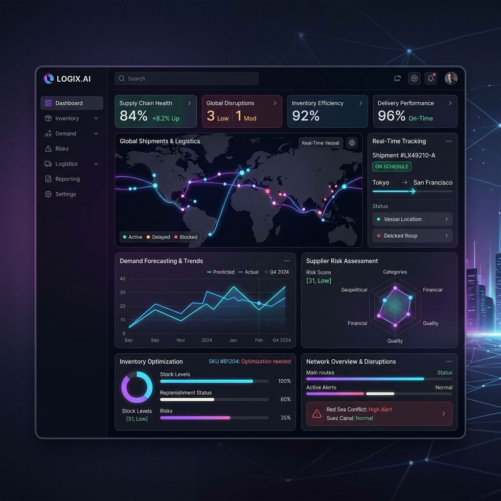

<div align="center">
  <h1>🔗 SynChain</h1>
  <p><strong>AI-Powered Supply Chain Intelligence Platform</strong></p>

  <!-- Badges -->
  <p>
    
    
    
    
    
    
    
    
    
  </p>

  <p>
    <em>A sophisticated decision intelligence platform moving beyond static dashboards to simulate, forecast, and de-risk supply chain operations.</em>
  </p>
</div>

---

<div align="center">
  
  <p><em>(Placeholder for Hero Image)</em></p>
</div>

---

## 📖 Overview

**SynChain** is an advanced AI-powered supply chain decision intelligence platform. It replaces reactive, static dashboards with a **Multi-Agent System** and **Digital Twins** to actively simulate supply chain operations, forecast future demand, detect risks, and integrate real-world external signals (news, weather, commodities, economics).

When faced with supply delays, inventory shortages, or market shifts, SynChain provides actionable recommendations complete with confidence scores and natural-language explanations.

## 🚨 Problem Statement

Modern supply chains are highly complex, globally distributed, and extremely vulnerable to sudden shocks (e.g., geopolitical events, extreme weather, demand spikes). Traditional ERP systems provide historical reporting but fail to answer the critical questions: 
*What is happening right now? What will happen next week? What should we do about it?*

SynChain bridges this gap by turning passive data into active intelligence.

## ✨ Features

- 🤖 **Multi-Agent Simulation**: A fleet of 6 specialized agents (Demand, Inventory, Logistics, Risk, Decision, Explanation) evaluate complex supply chain scenarios collaboratively.
- 👯 **Digital Twins**: Virtual replicas of real supply chains that track product demand, supplier reliability, and warehouse utilization dynamically.
- 📈 **Forecast Engine**: Multi-horizon forecasting that computes base demand influenced by trend, seasonality, and external risk signals.
- 📡 **Signal Intelligence (OSINT)**: Detects internal anomalies and integrates external events (News, Weather, Commodities) to adjust forecast confidence and elevate risk tiers.
- 🧠 **Compound Signals**: Identifies complex patterns like *Supply Shocks* or *Perfect Storms* when multiple risk signals co-occur.
- 🏢 **Multi-Tenant Architecture**: Built-in authentication, RBAC, API key management, and strict data isolation across organizations.

## 🏗️ Architecture

SynChain operates on a layered architecture separating core data operations from advanced AI workflows.

<div align="center">
  
  <p><em>(Placeholder for System Architecture Diagram)</em></p>
</div>

- **Data Layer:** SQLite with SQLAlchemy ORM (easily swappable to PostgreSQL).
- **Service Layer:** FastAPI for high-performance REST APIs.
- **Intelligence Layer:** Autonomous Python-based agents and digital twin state machines.
- **Presentation Layer:** Next.js frontend with Tailwind CSS and Recharts for rich data visualization.

## 🛠️ Tech Stack

- **Backend Framework**: [FastAPI](https://fastapi.tiangolo.com/) (Python 3.14)
- **Database & ORM**: [SQLite](https://www.sqlite.org/), [SQLAlchemy](https://www.sqlalchemy.org/), [Alembic](https://alembic.sqlalchemy.org/)
- **Frontend Framework**: [Next.js 16](https://nextjs.org/) (React)
- **Language**: [TypeScript](https://www.typescriptlang.org/)
- **UI & Styling**: [Tailwind CSS](https://tailwindcss.com/), [shadcn/ui](https://ui.shadcn.com/), Radix UI
- **Data Visualization**: [Recharts](https://recharts.org/)
- **Testing**: [Pytest](https://docs.pytest.org/) (500+ passing tests)

## 📂 Project Structure

```text
SynChain/
├── frontend/               # Next.js React application (UI, charts, dashboards)
├── backend/                # FastAPI application (Agents, Twins, Forecasting, API)
│   ├── agents/             # Multi-Agent logic
│   ├── digital_twin/       # Digital Twin state management
│   ├── forecasting/        # Multi-horizon forecast engine
│   ├── signals/            # Signal intelligence & event detection
│   ├── alembic/            # Database migrations
│   └── tests/              # 500+ unit and integration tests
├── database/               # Database schemas and SQLite file (supply_chain.db)
├── docs/                   # Technical documentation and guides
└── assets/                 # Screenshots and diagrams for documentation
```

## 📸 Screenshots

| Dashboard | Simulation |
| :---: | :---: |
|  |  |
| *Main Overview Dashboard* | *Multi-Agent Simulation Run* |

| Forecast Dashboard | Signal Dashboard |
| :---: | :---: |
|  |  |
| *Multi-Horizon Forecasting* | *Risk & OSINT Signal Intelligence* |

| Digital Twin | 
| :---: |
|  |
| *Digital Twin State Management* | 

*(Note: Add screenshot files to the `assets/` folder to render them above.)*

## ⚙️ How It Works

### AI Pipeline
When a user triggers a simulation, a coordinator agent spins up specialized sub-agents. The `Demand Agent` looks at historical trends, the `Inventory Agent` checks stock levels, and the `Logistics Agent` calculates transit times. They report to the `Risk Agent`, which passes a consolidated threat profile to the `Decision Agent` to formulate a final recommendation, translated into human-readable text by the `Explanation Agent`.

### Digital Twin
The system creates a mathematical mapping of physical entities (warehouses, suppliers, products). It uses Exponentially Weighted Moving Averages (EWMA) to smoothly update states over time, learning from historical simulations and anomalies to refine its accuracy.

### Forecast Engine
The forecast engine looks beyond linear math. It calculates a baseline demand and applies dynamic modifiers based on the Digital Twin's health score and active intelligence signals, generating short, medium, and long-term (H1, H3, H5) predictions.

### Signal Intelligence
SynChain scans for internal threshold breaches (e.g., inventory dropping below safety stock) and ingests external API data (News, Weather, Commodities). These raw signals are aggregated into "Compound Signals" when they co-occur, severely penalizing the Digital Twin's health score and alerting the user.

### CSV Import
A robust ingestion engine allows for bulk uploading of Products, Suppliers, and Warehouses via CSV, making onboarding seamless and instantly populating the Digital Twin environment.

## 🚀 Installation & Running Locally

### Prerequisites
- Python 3.14+
- Node.js 18+
- npm or pnpm

### 1. Backend Setup

```bash
# Navigate to backend
cd backend

# Create and activate a virtual environment
python -m venv .venv
# Windows: .\ .venv\Scripts\Activate.ps1
# Mac/Linux: source .venv/bin/activate

# Install dependencies
pip install -r requirements.txt

# Setup environment variables
cp .env.example .env
# Edit .env with your specific configurations

# Run database migrations
alembic upgrade head

# Start the FastAPI server
uvicorn main:app --reload --port 8000
```
*API available at `http://localhost:8000`*

### 2. Frontend Setup

```bash
# Navigate to frontend
cd frontend

# Install dependencies
npm install

# Start the development server
npm run dev
```
*UI available at `http://localhost:3000`*

## 📚 API Documentation

Once the backend is running, you can access the interactive API documentation automatically generated by FastAPI:
- **Swagger UI:** `http://localhost:8000/docs`
- **ReDoc:** `http://localhost:8000/redoc`

Detailed endpoint references and payloads can be found in [`backend/API_REFERENCE.md`](./backend/API_REFERENCE.md).

## 🗺️ Future Roadmap

- [ ] **PostgreSQL Migration:** Full transition from SQLite for enterprise-scale deployments.
- [ ] **Real-time API Integrations:** Live ingestion of maritime tracking and global weather APIs.
- [ ] **Advanced LLM Integration:** Allowing natural language queries over the supply chain database.
- [ ] **IoT Sensor Mocking:** Simulating temperature/humidity sensors for cold-chain logistics.

## 📄 License

This project is licensed under the **MIT License** - see the `LICENSE` file for details.

## 👤 Author

Developed by [Your Name / Organization]
