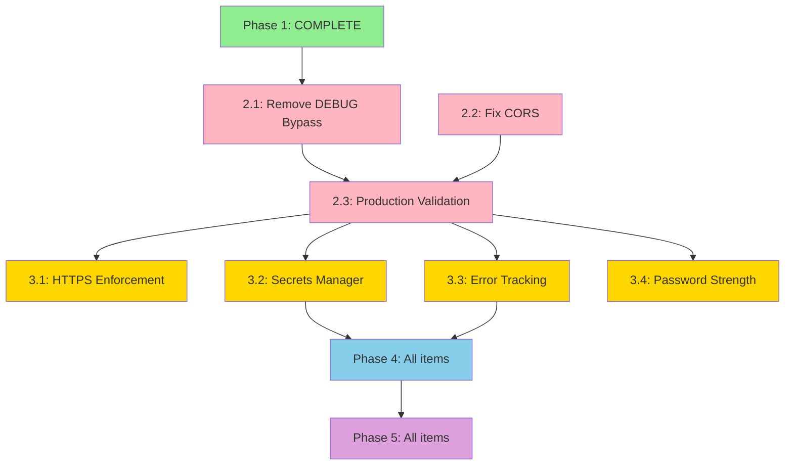

# Production Hardening Implementation Plan — SynChain Backend

**Date:** 2026-06-21  
**Status:** Planning  
**Total Estimated Effort:** 28-36 hours across 4 phases

---

## Executive Summary

This plan addresses 17 security and operational issues identified across three audit documents:
- Production Readiness Audit (2 Critical, 4 High, 6 Medium, 5 Low)
- Phase 1 Verification (JWT enforcement, rate limiting, route deduplication — **✅ COMPLETE**)
- Remaining blockers organized into 4 implementation phases

Issues are grouped into 4 phases by priority, with dependencies mapped and effort estimated.

---

## Phase Overview

| Phase | Priority | Items | Estimated Hours | Blocks Production? |
|-------|----------|-------|----------------|-------------------|
| Phase 1 | Critical | 5 items | 6h | ✅ **COMPLETE** |
| Phase 2 | Critical | 3 items | 8-10h | 🔴 **YES** |
| Phase 3 | High | 4 items | 10-12h | 🟠 NO (post-deploy) |
| Phase 4 | Medium | 6 items | 8-10h | 🟡 NO (30 days) |
| Phase 5 | Low | 5 items | 6-8h | 🟢 NO (improvements) |

**Total:** 38-46 hours over 7 weeks

---

## Phase 1: Foundation Security ✅ COMPLETE

**Status:** Completed 2026-06-21  
**Effort:** 6 hours

### Completed Items
- [x] JWT secret key enforcement (C2)
- [x] Rate limiting on auth endpoints (C4)
- [x] Rate limiting on write endpoints (C4)
- [x] CSV import route deduplication (C5)
- [x] Narrow exception handling in CSV import (H4)
- [x] File size limits enforced (B2)

**Verification:** See `PHASE_1_COMPLETE.md` for details

---

## Phase 2: Critical Production Blockers

**Timeline:** Week 1 (Pre-Deployment)  
**Estimated Effort:** 8-10 hours  
**Status:** 🔴 **BLOCKS PRODUCTION DEPLOYMENT**

### 2.1 Remove DEBUG Auth Bypass (C1)

**Issue:** `DEBUG=true` bypasses JWT validation entirely  
**Location:** `backend/auth/dependencies.py`  
**Effort:** 4-5 hours  
**Dependencies:** None

**Current Code:**
```python
if settings.debug:
    return UserContext(user_id=-1, company_id=-1, org_id=-1, email="debug@test.local")
```

**Implementation Steps:**

1. **Create auth test fixtures** (2 hours)
   ```python
   # tests/conftest.py
   @pytest.fixture
   def auth_client(client, db_session):
       """Client with authenticated user"""
       user = create_test_user(db_session, email="test@example.com")
       token = create_access_token({"sub": user.id})
       client.headers["Authorization"] = f"Bearer {token}"
       return client
   ```

2. **Update all tests** (1.5 hours)
   - Replace bare `client` with `auth_client` fixture
   - Update test expectations for auth-required endpoints
   - Verify 401 responses for unauthenticated requests

3. **Remove DEBUG bypass** (30 min)
   - Delete `if settings.debug:` branch in `get_current_user()`
   - Remove fake `UserContext` creation

4. **Add production guard** (30 min)
   ```python
   # config.py
   if settings.debug and "prod" in settings.database_url:
       raise RuntimeError("Cannot run DEBUG=true against production database")
   ```

5. **Verify** (30 min)
   ```bash
   export DEBUG=false
   pytest tests/ -x  # All tests should pass
   ```

**Risk if deferred:** Complete authentication bypass if `DEBUG=true` set in production

---
### 2.2 Fix CORS Wildcard Configuration (C2)

**Issue:** `allow_origins=["*"]` permits requests from any domain  
**Location:** `backend/main.py`  
**Effort:** 2 hours  
**Dependencies:** Requires frontend production URL(s)

**Current Code:**
```python
app.add_middleware(
    CORSMiddleware,
    allow_origins=["*"],  # ⚠️ SECURITY ISSUE
    allow_credentials=True,
)
```

**Implementation Steps:**

1. **Add environment variable** (15 min)
   ```bash
   # .env.production
   ALLOWED_ORIGINS=https://app.synchain.io,https://www.synchain.io
   ```
   
   ```python
   # config.py
   allowed_origins: list[str] = Field(
       default_factory=lambda: os.getenv("ALLOWED_ORIGINS", "").split(","),
       description="Comma-separated CORS origins"
   )
   ```

2. **Update CORS middleware** (30 min)
   ```python
   # main.py
   if not settings.debug:
       if not settings.allowed_origins or settings.allowed_origins == [""]:
           raise RuntimeError("ALLOWED_ORIGINS required in production")
   
   app.add_middleware(
       CORSMiddleware,
       allow_origins=settings.allowed_origins if not settings.debug else ["http://localhost:3000"],
       allow_credentials=True,
       allow_methods=["GET", "POST", "PUT", "PATCH", "DELETE"],
       allow_headers=["Content-Type", "Authorization"],
   )
   ```

3. **Add tests** (1 hour)
   - Test preflight from allowed origin → 200
   - Test preflight from disallowed origin → no CORS headers
   - Test credentials with allowed origin

4. **Document** (15 min)
   - Update deployment guide with CORS config section

**Verification:**
```bash
export ALLOWED_ORIGINS="https://app.synchain.io"
curl -X OPTIONS https://api.synchain.io/api/v1/auth/login \
  -H "Origin: https://evil.com" -v
# Expected: No Access-Control-Allow-Origin header
```

**Risk if deferred:** CSRF attacks, credential theft

---
### 2.3 Add Production Environment Validation

**Issue:** No automated check that production config is secure  
**Effort:** 2 hours  
**Dependencies:** 2.1, 2.2 complete

**Implementation Steps:**

1. **Create startup validation module** (1 hour)
   ```python
   # backend/startup_checks.py
   def validate_production_config():
       if not settings.debug:
           # JWT check
           if not settings.jwt_secret_key or settings.jwt_secret_key == "synchain-dev-only":
               raise RuntimeError("Invalid JWT secret for production")
           
           # CORS check
           if "*" in settings.allowed_origins:
               raise RuntimeError("CORS wildcard not allowed in production")
           
           # Database check
           if "localhost" in settings.database_url:
               logger.warning("Using localhost database in production mode")
           
           # Secrets check
           weak_keys = ["your_", "test_", "placeholder", "example"]
           if any(k in settings.newsapi_key.lower() for k in weak_keys):
               logger.warning("External API keys appear to be placeholders")
   ```

2. **Add to startup event** (15 min)
   ```python
   # main.py
   @app.on_event("startup")
   async def startup_validation():
       from startup_checks import validate_production_config
       validate_production_config()
   ```

3. **Add tests** (45 min)
   - Test each validation condition triggers RuntimeError
   - Test production config passes validation

**Verification:**
```bash
export DEBUG=false
export JWT_SECRET_KEY="synchain-dev-only"
python -c "from main import app"
# Expected: RuntimeError on startup
```

---

## Phase 3: High-Priority Security

**Timeline:** Week 2-3 (Post-Deployment)  
**Estimated Effort:** 10-12 hours  
**Status:** 🟠 Deploy first, implement immediately after

### 3.1 HTTPS Enforcement Middleware (H1)

**Issue:** Application accepts HTTP connections  
**Effort:** 1 hour  
**Dependencies:** None

**Implementation Steps:**

1. **Add middleware** (30 min)
   ```python
   # main.py
   from starlette.middleware.httpsredirect import HTTPSRedirectMiddleware
   
   if not settings.debug:
       app.add_middleware(HTTPSRedirectMiddleware)
   ```

2. **Add HSTS header** (15 min)
   ```python
   # middleware.py - update SecurityHeadersMiddleware
   if not request.url.scheme == "http":
       headers["Strict-Transport-Security"] = "max-age=31536000; includeSubDomains"
   ```

3. **Test** (15 min)
   - Verify HTTP → HTTPS redirect
   - Verify HSTS header present on HTTPS responses

**Risk if deferred:** Credentials transmitted in plaintext

---
### 3.2 Migrate Secrets to Secrets Manager (H2)

**Issue:** Secrets stored as plaintext environment variables  
**Effort:** 4-5 hours  
**Dependencies:** AWS/Azure/GCP account with secrets manager access

**Implementation Steps:**

1. **Choose secrets backend** (30 min)
   - AWS Secrets Manager, Azure Key Vault, or HashiCorp Vault
   - Install: `pip install boto3` (for AWS)

2. **Create secrets module** (2 hours)
   ```python
   # backend/secrets.py
   import boto3
   from functools import lru_cache
   
   @lru_cache(maxsize=128)
   def get_secret(secret_name: str) -> str:
       if settings.debug:
           # Fall back to env vars in dev
           return os.getenv(secret_name, "")
       
       client = boto3.client('secretsmanager')
       response = client.get_secret_value(SecretId=secret_name)
       return response['SecretString']
   ```

3. **Update config.py** (1 hour)
   ```python
   jwt_secret_key: str = Field(
       default_factory=lambda: get_secret("synchain/jwt-secret"),
       description="JWT signing key"
   )
   ```

4. **Migrate secrets** (1 hour)
   - Create secrets in secrets manager
   - Update deployment config for IAM permissions
   - Verify retrieval works

5. **Test** (30 min)
   - Test auth works with secrets manager
   - Test fallback to env vars in dev mode

**Risk if deferred:** Secrets visible in process environment, logs, crash dumps

---

### 3.3 Integrate Error Tracking (H3)

**Issue:** No monitoring/alerting integration  
**Effort:** 2-3 hours  
**Dependencies:** Sentry account (or similar)

**Implementation Steps:**

1. **Install Sentry SDK** (15 min)
   ```bash
   pip install sentry-sdk[fastapi]==1.40.0
   ```

2. **Configure Sentry** (1 hour)
   ```python
   # main.py
   import sentry_sdk
   from sentry_sdk.integrations.fastapi import FastApiIntegration
   
   if not settings.debug:
       sentry_sdk.init(
           dsn=get_secret("synchain/sentry-dsn"),
           integrations=[FastApiIntegration()],
           traces_sample_rate=0.1,
           environment="production",
           release=settings.app_version,
       )
   ```

3. **Test error capture** (30 min)
   - Trigger intentional error
   - Verify appears in Sentry dashboard
   - Test user context captured

4. **Configure alerts** (1 hour)
   - Set up Slack/PagerDuty integration
   - Configure alert rules (>10 errors/min)
   - Test alert delivery

**Risk if deferred:** Undetected outages, no incident response

---
### 3.4 Strengthen Password Requirements (H4)

**Issue:** No password complexity validation  
**Effort:** 2 hours  
**Dependencies:** None

**Implementation Steps:**

1. **Add validation library** (15 min)
   ```bash
   pip install zxcvbn==4.4.28
   ```

2. **Create password validator** (1 hour)
   ```python
   # auth/validators.py
   from zxcvbn import zxcvbn
   import re
   
   def validate_password_strength(password: str) -> tuple[bool, str]:
       if len(password) < 12:
           return False, "Password must be at least 12 characters"
       
       # Check complexity
       if not re.search(r'[A-Z]', password):
           return False, "Password must contain uppercase letter"
       if not re.search(r'[a-z]', password):
           return False, "Password must contain lowercase letter"
       if not re.search(r'[0-9]', password):
           return False, "Password must contain digit"
       if not re.search(r'[^A-Za-z0-9]', password):
           return False, "Password must contain special character"
       
       # Check against common passwords
       strength = zxcvbn(password)
       if strength['score'] < 3:
           return False, "Password too common or predictable"
       
       return True, ""
   ```

3. **Update registration endpoint** (30 min)
   ```python
   # auth/router.py
   valid, error = validate_password_strength(req.password)
   if not valid:
       raise HTTPException(status_code=400, detail=error)
   ```

4. **Add tests** (15 min)
   - Test weak passwords rejected
   - Test strong passwords accepted

**Risk if deferred:** Account compromise via dictionary attacks

---

## Phase 4: Medium-Priority Hardening

**Timeline:** Week 4-5  
**Estimated Effort:** 8-10 hours  
**Status:** 🟡 Implement within 30 days

### 4.1 Request Body Size Limits (M1)

**Effort:** 2 hours  
**Dependencies:** None

**Implementation:**
```python
# middleware.py
from starlette.middleware.base import BaseHTTPMiddleware

class RequestSizeLimitMiddleware(BaseHTTPMiddleware):
    async def dispatch(self, request, call_next):
        max_size = 10 * 1024 * 1024  # 10MB
        body = b""
        async for chunk in request.stream():
            body += chunk
            if len(body) > max_size:
                return JSONResponse(
                    {"error": "Request body too large"},
                    status_code=413
                )
        request._body = body
        return await call_next(request)
```

**Tasks:**
- Implement middleware (1 hour)
- Test with oversized payloads (30 min)
- Document limits in API docs (30 min)

---
### 4.2 Audit Logging for Sensitive Operations (M2)

**Effort:** 3 hours  
**Dependencies:** None

**Implementation:**
```python
# audit_logger.py
import logging
from datetime import datetime

audit_logger = logging.getLogger("audit")

def log_auth_event(event_type: str, user_id: int, email: str, 
                   ip_address: str, success: bool, details: dict = None):
    audit_logger.info({
        "timestamp": datetime.utcnow().isoformat(),
        "event_type": event_type,
        "user_id": user_id,
        "email": email,
        "ip_address": ip_address,
        "success": success,
        "details": details
    })
```

**Tasks:**
- Create audit logger module (1 hour)
- Add audit logs to auth endpoints (1 hour)
- Add audit logs to data mutation endpoints (1 hour)

**Events to log:**
- Login attempts (success/failure)
- Password changes
- Account creation
- CSV imports
- Simulation runs

---

### 4.3 Restrict Health Endpoint (M3)

**Effort:** 1 hour  
**Dependencies:** None

**Implementation:**
```python
# main.py
@app.get("/health")
async def health_check():
    return {"status": "ok"}

@app.get("/health/detailed")
async def detailed_health_check(
    current_user: UserContext = Depends(get_current_user)
):
    if not is_admin(current_user):
        raise HTTPException(403)
    
    return {
        "status": "ok",
        "database": await check_database(),
        "redis": await check_redis(),
        "version": app.version
    }
```

**Tasks:**
- Create public health endpoint (30 min)
- Create admin-only detailed endpoint (30 min)

---

### 4.4 Configure Database Connection Pool (M4)

**Effort:** 1 hour  
**Dependencies:** None

**Implementation:**
```python
# database.py
engine = create_engine(
    settings.database_url,
    pool_size=20,           # Base connection pool
    max_overflow=10,        # Additional connections
    pool_timeout=30,        # Wait for connection (sec)
    pool_recycle=3600,      # Recycle after 1 hour
    pool_pre_ping=True      # Verify before use
)
```

**Tasks:**
- Update database.py with pool config (30 min)
- Test connection limits under load (30 min)

---
### 4.5 Sanitize Error Messages (M5)

**Effort:** 1 hour  
**Dependencies:** None

**Implementation:**
```python
# main.py
@app.exception_handler(Exception)
async def generic_exception_handler(request, exc):
    if settings.debug:
        raise exc  # Show details in dev
    
    # Production: generic error
    logger.exception("Unhandled exception", exc_info=exc)
    return JSONResponse(
        {"error": "An internal error occurred"},
        status_code=500
    )
```

**Tasks:**
- Add generic exception handler (30 min)
- Test error responses don't leak details (30 min)

---

### 4.6 Input Sanitization Middleware (M6)

**Effort:** 2 hours  
**Dependencies:** None

**Implementation:**
```python
# validators.py
from bleach import clean

def sanitize_text_fields(data: dict) -> dict:
    for key, value in data.items():
        if isinstance(value, str):
            data[key] = clean(value, tags=[], strip=True)
    return data
```

**Tasks:**
- Install bleach library (5 min)
- Create sanitization validators (1 hour)
- Apply to text input fields (45 min)
- Test XSS prevention (10 min)

---

## Phase 5: Low-Priority Improvements

**Timeline:** Week 6-8  
**Estimated Effort:** 6-8 hours  
**Status:** 🟢 Quality-of-life improvements

### 5.1 Request ID Tracing (L1)

**Effort:** 1 hour

**Implementation:**
```python
# middleware.py
import uuid
from starlette.middleware.base import BaseHTTPMiddleware

class RequestIDMiddleware(BaseHTTPMiddleware):
    async def dispatch(self, request, call_next):
        request_id = request.headers.get("X-Request-ID", str(uuid.uuid4()))
        request.state.request_id = request_id
        response = await call_next(request)
        response.headers["X-Request-ID"] = request_id
        return response
```

---

### 5.2 Graceful Shutdown Handler (L2)

**Effort:** 1 hour

**Implementation:**
```python
# main.py
import signal
import asyncio

async def shutdown_handler():
    logger.info("Graceful shutdown initiated")
    await engine.dispose()
    await asyncio.sleep(5)

@app.on_event("startup")
def register_shutdown():
    signal.signal(signal.SIGTERM, lambda s, f: asyncio.create_task(shutdown_handler()))
```

---
### 5.3 Structured Logging (L3)

**Effort:** 2 hours

**Implementation:**
```python
# main.py
import structlog

structlog.configure(
    processors=[
        structlog.stdlib.add_log_level,
        structlog.stdlib.add_logger_name,
        structlog.processors.TimeStamper(fmt="iso"),
        structlog.processors.JSONRenderer()
    ]
)
```

---

### 5.4 Rate Limit Service Account Bypass (L4)

**Effort:** 1 hour

**Implementation:**
```python
# rate_limiter.py
def rate_limit(category: str):
    async def dependency(request: Request):
        # Check for service account header
        if request.headers.get("X-Service-Account-Token") == settings.service_token:
            return
        
        # Apply normal rate limiting
        await limiter.check(category, request)
    return Depends(dependency)
```

---

### 5.5 Database Migration Version Check (L5)

**Effort:** 2 hours

**Implementation:**
```python
# main.py
from alembic import command
from alembic.config import Config

@app.on_event("startup")
def check_migrations():
    alembic_cfg = Config("alembic.ini")
    with engine.begin() as conn:
        context = MigrationContext.configure(conn)
        current_rev = context.get_current_revision()
        
        if current_rev != EXPECTED_MIGRATION_VERSION:
            logger.error(f"Migration mismatch: {current_rev} vs {EXPECTED_MIGRATION_VERSION}")
            if not settings.debug:
                raise RuntimeError("Database migration version mismatch")
```

---

## Dependency Graph



---
## Effort Summary

| Phase | Priority | Hours | Blocking? |
|-------|----------|-------|----------|
| Phase 1 | Critical (JWT, Rate Limiting, Routes) | 6 | ✅ COMPLETE |
| Phase 2 | Critical (Auth Bypass, CORS) | 8-10 | 🔴 YES |
| Phase 3 | High (HTTPS, Secrets, Monitoring, Passwords) | 10-12 | 🟠 NO |
| Phase 4 | Medium (6 items) | 8-10 | 🟡 NO |
| Phase 5 | Low (5 items) | 6-8 | 🟢 NO |
| **Total** | | **38-46 hours** | |

---

## Risk-Based Deployment Decision Matrix

| Scenario | Can Deploy? | Required Phases | Notes |
|----------|-------------|-----------------|-------|
| **Internal staging** | ✅ Yes | Phase 1 only | Acceptable risk for internal testing |
| **Private beta (trusted users)** | ⚠️ Maybe | Phases 1, 2 | Must complete C1, C2 first |
| **Public beta** | ❌ No | Phases 1, 2, 3 | Requires monitoring |
| **Production (GA)** | ❌ No | Phases 1-4 | All critical + high + medium |

---

## Pre-Deployment Checklist (Phases 1-2)

**Phase 1 (Complete):**
- [x] JWT secret key enforcement
- [x] Rate limiting on sensitive endpoints
- [x] CSV import route deduplication
- [x] File size limits enforced
- [x] Narrow exception handling

**Phase 2 (Pre-Deployment):**
- [ ] DEBUG auth bypass removed
- [ ] Test fixtures refactored to use JWT
- [ ] CORS restricted to production domains
- [ ] Production config validation at startup
- [ ] All tests passing without DEBUG=true
- [ ] Audit script works with production auth

**Environment Variables:**
- [ ] `DEBUG=false`
- [ ] `JWT_SECRET_KEY` (32+ random bytes)
- [ ] `ALLOWED_ORIGINS` (comma-separated frontend URLs)
- [ ] `DATABASE_URL` (production database)

---

## Week-by-Week Timeline

### Week 1: Critical Blockers (Phase 2)
- **Mon-Tue:** Remove DEBUG auth bypass (2.1)
- **Wed:** Fix CORS configuration (2.2)
- **Thu:** Production validation (2.3)
- **Fri:** Integration testing + deployment prep

**Milestone:** Ready for production deployment

---

### Week 2: High-Priority Security (Phase 3)
- **Mon:** HTTPS enforcement (3.1)
- **Tue-Wed:** Secrets manager migration (3.2)
- **Thu:** Error tracking integration (3.3)
- **Fri:** Password strength validation (3.4)

**Milestone:** Production security hardened

---

### Week 3-4: Medium-Priority (Phase 4)
- **Week 3:** Request size limits (M1), Audit logging (M2), Health endpoint (M3)
- **Week 4:** DB pool config (M4), Error sanitization (M5), Input sanitization (M6)

**Milestone:** OWASP Top 10 compliance achieved

---

### Week 5-6: Low-Priority (Phase 5)
- **Week 5:** Request ID tracing (L1), Graceful shutdown (L2), Structured logging (L3)
- **Week 6:** Service account bypass (L4), Migration version check (L5)

**Milestone:** Production observability optimized

---
## Testing Strategy

### Unit Tests (Per Phase)
- All new code must have >80% test coverage
- Mock external dependencies (secrets manager, Sentry)
- Test both success and failure paths

### Integration Tests
- End-to-end auth flow without DEBUG mode
- CORS preflight from allowed and disallowed origins
- Rate limiting with real Redis (not in-memory)
- Error tracking with Sentry mock

### Security Tests
- **Automated:** OWASP ZAP scan on staging
- **Manual:** Penetration test after Phase 3
- **Regression:** Re-run all audits after Phase 4

### Load Tests
- Simulate 1000 concurrent users
- Verify rate limiting triggers correctly
- Verify DB connection pool limits respected
- Measure response times under load

---

## Rollback Plan

### Phase 2 Rollback
If production deployment fails:
1. Revert to Phase 1 codebase (tag: `phase-1-complete`)
2. Re-enable DEBUG mode temporarily (emergency only)
3. Investigate failure in staging
4. **Do NOT leave DEBUG=true for >1 hour in production**

### Phase 3 Rollback
If secrets manager fails:
1. Fallback to environment variables (already implemented)
2. Secrets module has built-in fallback for `settings.debug`
3. Monitor error tracking for degraded performance

### Phase 4 Rollback
Each medium-priority fix is independent:
- Disable via feature flag if causing issues
- No interdependencies between M1-M6

---

## Success Metrics

### Phase 2 Success Criteria
- [ ] All tests pass with `DEBUG=false`
- [ ] CORS preflight blocked from non-whitelisted origins
- [ ] Production config validation prevents misconfiguration
- [ ] Zero auth bypass vulnerabilities in pentest

### Phase 3 Success Criteria
- [ ] All HTTP requests redirect to HTTPS
- [ ] No secrets visible in environment variables
- [ ] Errors captured in Sentry within 60 seconds
- [ ] Weak passwords rejected at registration

### Phase 4 Success Criteria
- [ ] Request body >10MB rejected
- [ ] All auth events logged with IP and timestamp
- [ ] Health endpoint does not expose sensitive info
- [ ] DB connection pool prevents >30 concurrent connections

### Phase 5 Success Criteria
- [ ] All requests have unique `X-Request-ID`
- [ ] Graceful shutdown completes in <10 seconds
- [ ] Logs parseable as JSON in CloudWatch
- [ ] Service accounts bypass rate limits

---
## Post-Implementation

### Documentation Updates
- [ ] Update API_REFERENCE.md with security headers
- [ ] Document CORS configuration for frontend team
- [ ] Create secrets rotation runbook
- [ ] Update deployment guide with Phase 2 requirements

### Training
- [ ] Brief dev team on new auth test fixtures
- [ ] Train ops team on secrets manager usage
- [ ] Review incident response runbook with on-call

### Continuous Improvement
- [ ] Schedule quarterly security audits
- [ ] Set up dependency vulnerability scanning (Snyk, Dependabot)
- [ ] Enable AWS Security Hub / Azure Security Center
- [ ] Plan Phase 6 (PCI-DSS compliance, if needed)

---

## Approval & Sign-Off

**Plan Prepared By:** Security & Engineering Team  
**Date:** 2026-06-21

**Approvals Required:**
- [ ] Engineering Lead (Phases 1-5 technical review)
- [ ] Security Team (Phases 2-3 security controls)
- [ ] DevOps/SRE (Infrastructure readiness)
- [ ] Product Owner (Timeline and feature freeze)

**Estimated Start:** 2026-06-24  
**Estimated Completion:** 2026-08-12 (7 weeks)

---

## Questions & Answers

**Q: Can we skip Phase 2 and deploy now?**  
A: No. C1 (auth bypass) and C2 (CORS wildcard) are production blockers. Phase 2 must complete first.

**Q: Can we do Phase 3 before Phase 2?**  
A: Technically yes (no dependencies), but Phase 2 blocks deployment, so Phase 3 work would be wasted if deployment fails.

**Q: What if secrets manager is not available?**  
A: The code already has fallback to environment variables when `settings.debug=true`. This is acceptable for staging, NOT for production.

**Q: Can we deploy after Phase 2 only?**  
A: Yes, for private beta with trusted users. Public deployment requires Phase 3 (monitoring, HTTPS, secrets).

**Q: How do we handle Phase 1 already being complete?**  
A: Phase 1 is the foundation. All subsequent phases build on it. No rework needed.

---

## Deployment Verification Tests

After Phase 2 deployment, run these tests:

### 1. Auth Bypass Test
```bash
curl -X GET https://api.synchain.io/api/v1/companies \
  -H "Authorization: Bearer invalid_token"
# Expected: 401 Unauthorized
```

### 2. CORS Test
```bash
curl -X OPTIONS https://api.synchain.io/api/v1/auth/login \
  -H "Origin: https://evil.com" \
  -H "Access-Control-Request-Method: POST" -v
# Expected: No Access-Control-Allow-Origin header
```

### 3. Rate Limit Test
```bash
for i in {1..100}; do
  curl -X POST https://api.synchain.io/api/v1/auth/register \
    -H "Content-Type: application/json" \
    -d "{\"email\":\"test$i@example.com\",\"password\":\"test123\"}"
done
# Expected: 429 Too Many Requests after threshold
```

### 4. HTTPS Test (Phase 3)
```bash
curl -X GET http://api.synchain.io/health -v
# Expected: 301/302 redirect to https://
```

### 5. Secrets Test
```bash
export JWT_SECRET_KEY="synchain-dev-only"
export DEBUG=false
python -c "from config import settings"
# Expected: RuntimeError
```

---

**END OF PLAN**
